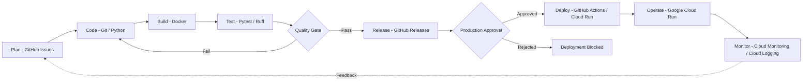

# CloudOps TaskHub – DevOps Lifecycle

## Overview

This document describes the DevOps lifecycle
of the CloudOps TaskHub project.

## Lifecycle Diagram

```mermaid
flowchart LR
    PLAN["Plan - GitHub Issues"]
    CODE["Code - Git / Python"]
    BUILD["Build - Docker"]
    TEST["Test - Pytest / Ruff"]
    RELEASE["Release - GitHub Releases"]
    DEPLOY["Deploy - GitHub Actions / Cloud Run"]
    OPERATE["Operate - Google Cloud Run"]
    MONITOR["Monitor - Cloud Monitoring / Cloud Logging"]
    QG{"Quality Gate"}
    APPROVAL{"Production Approval"}
    DEPLOYBLOCK["Deployment Blocked"]

    DEPLOY-->OPERATE
    OPERATE-->MONITOR
    MONITOR-.-> |"Feedback"| PLAN
    PLAN --> CODE
    CODE --> BUILD
    BUILD --> TEST
    TEST-->QG
    QG-->|"Pass"| RELEASE
    QG-->|"Fail"| CODE
    RELEASE-->APPROVAL
    APPROVAL-->|"Approved"|DEPLOY
    APPROVAL-->|"Rejected"|DEPLOYBLOCK
```

