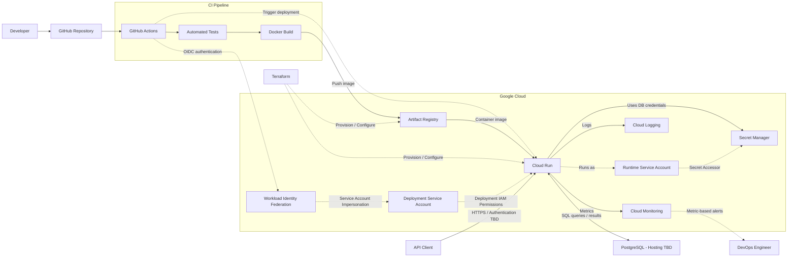

# CloudOps TaskHub – System Architecture

## Overview

This document describes the planned architecture of
the CloudOps TaskHub application

## Architecture Diagram

```mermaid
flowchart LR
    DEV["Developer"]
    GH["GitHub Repository"]
    PG["PostgreSQL - Hosting TBD"]
    TF["Terraform"]
    OPS["DevOps Engineer"]
    API["API Client"]

subgraph CI_PIPELINE["CI Pipeline"]
    CI["GitHub Actions"]
    AUTOTEST["Automated Tests"]
    BUILD["Docker Build"]
end

subgraph GOOGLE_CLOUD["Google Cloud"]
    AR["Artifact Registry"]
    CR["Cloud Run"]
    MON["Cloud Monitoring"]
    LOG["Cloud Logging"]
    WIF["Workload Identity Federation"]
    SA["Deployment Service Account"]
    SM["Secret Manager"]
    RSA["Runtime Service Account"]
end

    DEV --> GH
    GH --> CI
    CI --> AUTOTEST
    CI -.-> |"Trigger deployment"| CR
    AUTOTEST --> BUILD
    BUILD --> |"Push image"| AR
    AR --> |"Container image"| CR
    CR <--> |"SQL queries / results"| PG
    TF -.-> |"Provision / Configure"| AR
    TF -.-> |"Provision / Configure"| CR
    CR --> |"Metrics"| MON
    CR --> |"Logs"| LOG
    MON -.-> |"Metric-based alerts"| OPS
    CI -.-> |"OIDC authentication"| WIF
    WIF -.->|"Service Account Impersonation"| SA
    SA -.->|"Deployment IAM Permissions"| CR
    CR --> |"Uses DB credentials"| SM
    RSA -.-> |"Secret Accessor"| SM
    CR -.-> |"Runs as"| RSA
    API --> |"HTTPS / Authentication TBD"| CR

```